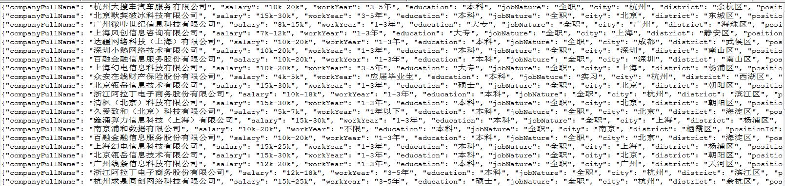
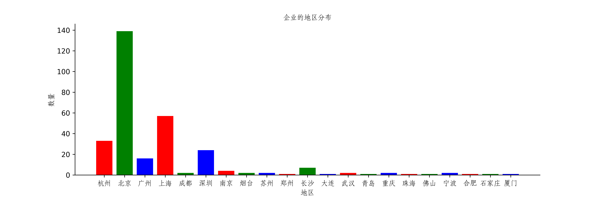
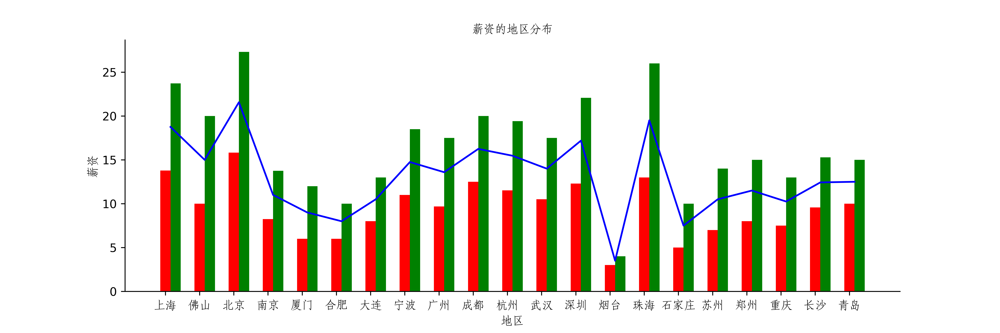

&nbsp;&nbsp;&nbsp;&nbsp;&nbsp;&nbsp;&nbsp;毕业季已经到来，想必很多同学也已经找到了心仪的工作，但我想还是有不少人跟我一样还在着急的找工作吧，所谓“知己知彼，百战不殆”，那我今天就随我一起来看看企业对不同岗位各有什么要求吧。

## 1、数据格式 ##
&nbsp;&nbsp;&nbsp;&nbsp;&nbsp;&nbsp;&nbsp;首先爬取了拉勾网“数据分析师”岗位的招聘信息，奈何拉勾网反爬机制太厉害（还是个人能力不太够），经过一番折腾，获取了300家企业的招聘信息，数据格式如下图所示：

## 2、数据分析 ##
接下来就是对获取到的数据的分析了，首先看看这些企业都分布在哪些城市吧

**1.** 地点分布

&nbsp;&nbsp;&nbsp;&nbsp;&nbsp;&nbsp;&nbsp;从图中可以看出，招聘“数据分析师”的企业多数还是集中于大城市，比如北京、上海、杭州、深圳和广州，其比例高达89.6%，想从事数据分析行业的童鞋们应该可以清楚要去哪些城市找工作啦。

**2.** 薪资分布

&nbsp;&nbsp;&nbsp;&nbsp;&nbsp;&nbsp;&nbsp;从薪资水平的整体分布来看，大城市的薪资水平明显高于小城市，在大型城市中，薪资的上限与下限也相差较大，其中北京、珠海、上海的薪资位于前三位，而烟台、石家庄和合肥的薪资处于垫底状态，毕竟大城市的消费水平也高嘛，想追求高质量生活的可以向大城市发展（哈哈）

**3.** 职位诱惑/岗位要求

&nbsp;&nbsp;&nbsp;&nbsp; 

&nbsp;&nbsp;&nbsp;&nbsp;&nbsp;&nbsp;&nbsp;从图中可以看到，企业对待人才的待遇还是不错的，一般都包括五险一金（六险一金的也不少）、年终奖、绩效奖金、福利好等等，对于我们求职者的诱惑还是蛮大的（嘻嘻）；另外，从事数据分析行业，我们同时也需具备一些能力，诸如Python、SQL、Excel这些都是数据分析离不开的工具，企业更青睐于有工作经验的人，毕竟干起活来快嘛，对于学历的要求也是不低的，基本要求都是本科及以上学历。

&nbsp;&nbsp;&nbsp;&nbsp;&nbsp;&nbsp;&nbsp;**好啦，由于本人能力有限，分析呢就这么多啦，总的来说，从事数据分析行业，我们还需去大城市，毕竟大城市实力强，工作机会多，更有利于我们个人的发展**

## 最后，奉上本人爬虫代码（以后还需完善），仅供参考 ##
<pre name = "code" class = "java">
import requests
import json
from requests.exceptions import  RequestException
from pyquery import PyQuery as pq
import random
from urllib.parse import quote

ua_list = [
        "Mozilla/5.0 (Windows NT 6.1; WOW64) AppleWebKit/537.1 (KHTML, like Gecko) Chrome/22.0.1207.1 Safari/537.1",
        "Mozilla/5.0 (X11; CrOS i686 2268.111.0) AppleWebKit/536.11 (KHTML, like Gecko) Chrome/20.0.1132.57 Safari/536.11",
        "Mozilla/5.0 (Windows NT 6.1; WOW64) AppleWebKit/536.6 (KHTML, like Gecko) Chrome/20.0.1092.0 Safari/536.6",
        "Mozilla/5.0 (Windows NT 6.2) AppleWebKit/536.6 (KHTML, like Gecko) Chrome/20.0.1090.0 Safari/536.6",
]

def get_header(keyword):
    user_agent = random.choice(ua_list)
    keywords = quote(keyword)
    referer = "https://www.lagou.com/jobs/list_"+keywords+"?labelWords=&fromSearch=true&suginput="
    headers = {
            "User-Agent":user_agent,
            "Host":"www.lagou.com",
            "Origin":"https://www.lagou.com",
            "Referer":referer
    }
    return headers

def parse_company_page(html):
    doc = pq(html)
    job_advantage = doc('.job-advantage').text().replace("\n","")
    job_bt = doc('.job_bt').text().replace("\n","")
    job_dict = {}
    job_dict["jobAdvantage"] = job_advantage
    job_dict["jobBt"] = job_bt
    return job_dict

def get_company_page(id):
    company_url = "https://www.lagou.com/jobs/{}.html".format(id)
    response = requests.get(company_url,headers=get_header(keyword))
    try:
        if response.status_code == 200:
            return  response.text
        return None
    except RequestException as e:
        print(e)

def parse_one_page(html):
    results = html["content"]["positionResult"]["result"]
    for result in results:
        yield {
            "companyFullName": result['companyFullName'],
            "salary": result['salary'],
            "workYear": result['workYear'],
            "education": result['education'],
            "jobNature": result['jobNature'],
            "city": result['city'],
            "district": result['district'],
            "positionId": result['positionId']
        }

def get_one_page(url,data):
    try:
        response = requests.post(url=url,data=data,headers=get_header(keyword))
        if response.status_code == 200:
            return json.loads(response.text)
        return None
    except RequestException as e:
        print(e)

def write_to_file(content):
    with open('数据分析师.txt','a',encoding='utf-8') as f:
        f.write(json.dumps(content,ensure_ascii=False)+'\n')
        f.close()

def main(page):
    if page == 1:
        first = "true"
    else:
        first = "false"

    data={"first":first,
          "pn":page,
          "kd":keyword}
    root_url = "https://www.lagou.com/jobs/positionAjax.json?px=default&needAddtionalResult=false"
    html = get_one_page(root_url,data)
    if html['success'] == True:
        if html['content']['pageNo'] != 0:
            for item in parse_one_page(html):
                positionId = item['positionId']
                html = get_company_page(positionId)
                item.update(parse_company_page(html))
                write_to_file(item)
            return True
        else:
            return False
    else:
        print("爬取内容失败",html['msg'])
        return  False
        
if __name__ == "__main__":
    keyword = "数据分析师"
    for i in range(20,31):
        print("正在爬取第",i,"页的数据")
        if main(i) == False:
            break
    print("获取数据完成")
</pre> 

        
