&nbsp;&nbsp;&nbsp;&nbsp;&nbsp;&nbsp;&nbsp;&nbsp;如今人工智能越来越火，python语言越来越受到重视，一般在生产环境下，服务器基本都是Liunx的，所以学习Linux系统和Python语言迫在眉睫，而在开始学习之前，我们首先得配置好Linux系统和Python运行环境，本人结合网上教程，经过了无数次重装系统，终于配好了Windows10和Ubuntu18.04双系统，以及anaconda运行环境，现在把过程记录下来，以供参考。
## 一、安装双系统 ##
### 1）Windows系统 ###
&nbsp;&nbsp;&nbsp;&nbsp;&nbsp;&nbsp;&nbsp;&nbsp;想必windows系统大家都会安装，只要准备好windows安装包，按照引导一步一步安装即可，这里不过多介绍。
### 2) 安装Ubuntu系统 ###
   1、首先，我们需要在网上下载Ubuntu系统，下载地址：https://www.ubuntu.com/download/desktop

   2、准备好一个空间比较大的U盘，制作系统盘，使用软件：Ultraiso软碟通工具，首先选择“文件-打开”，选择下载好的系统镜像，然后选择“启动-写入硬盘影像”，如果默认写入方式安装系统失败，请选择写入方式为“RAW”,写完后会有相应成功提示，成功后点击返回即可。
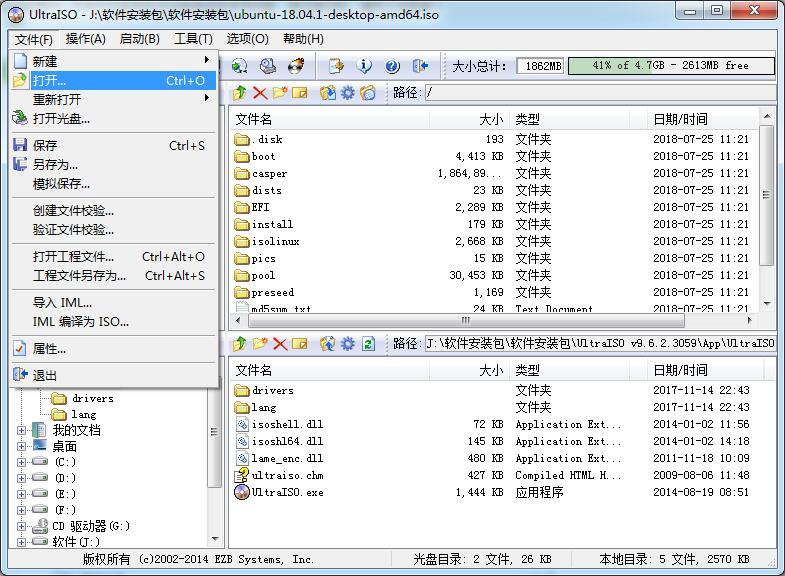
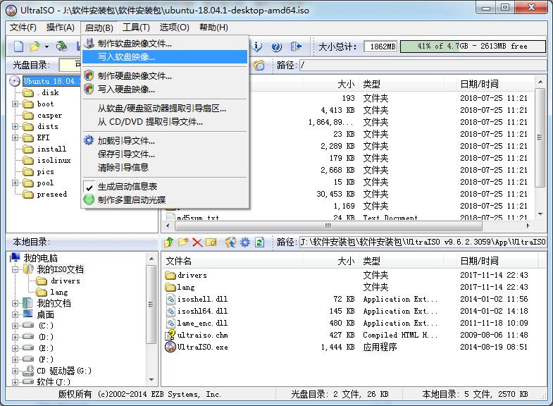
  3、安装Ubuntu系统，首先在原系统下压缩出一个足够大的硬盘空间，本人使用100G，压缩出的空间会显示为可用空间，无盘符。接着插入U盘，重启电脑，U盘启动安装界面，选择“试用不安装”或直接安装均可，前者在进入系统后桌面上有安装程序。
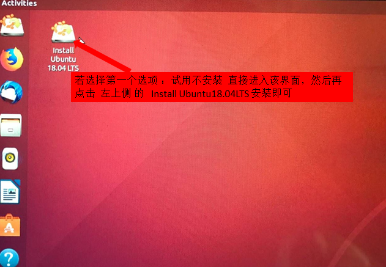

默认下一步、下一步直至安装类型选择“其它选项”
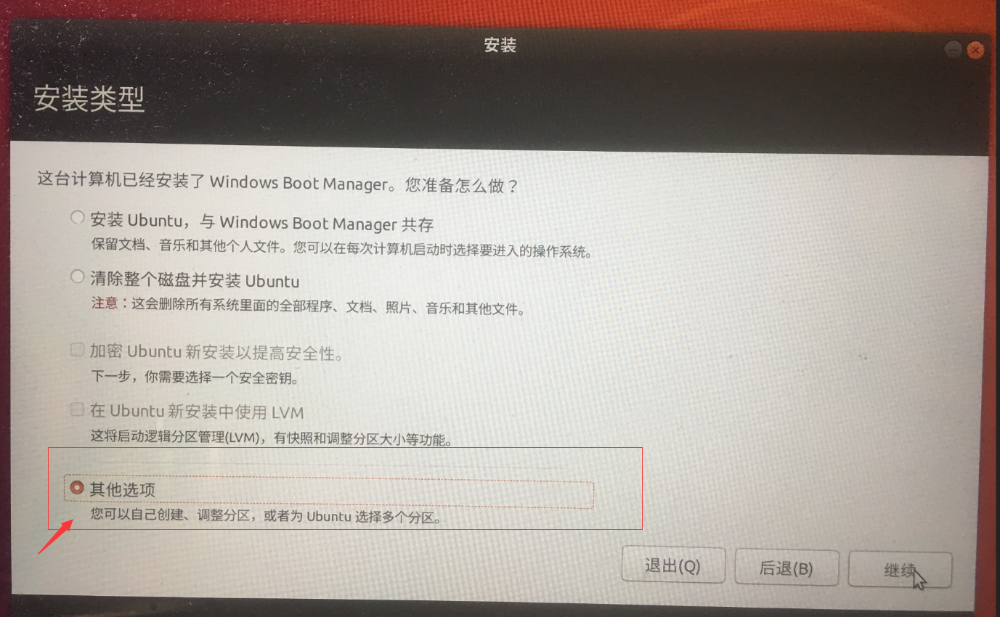
接下来我们需要设置许多分区（挂载点）（/boot,/,home,swap交换空间，/usr,等等）

第一点设置boot挂载点，参考信息如下，是用来存放系统引导的挂载点，大小200MB左右，我分了1GB，图片仅供参考
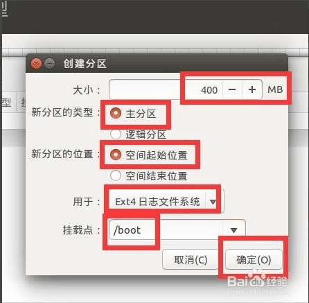

第二点设置交换空间swap，说直白点，硬盘与内存互动的空间，虚拟内存的意思。设置为内存大大小的2倍，我分了8GB
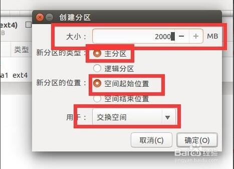

设置“   /  ”挂载点，大小随你，默认目录，分个8GB差不多，50GB的请分10-15G,我分了20GB
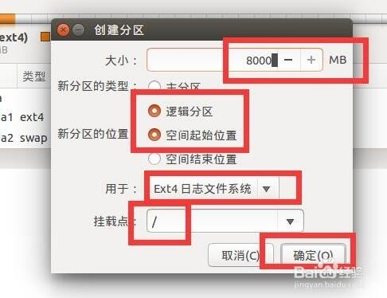

设置/home用户挂载点，大小10GB，我这里设置了30GB

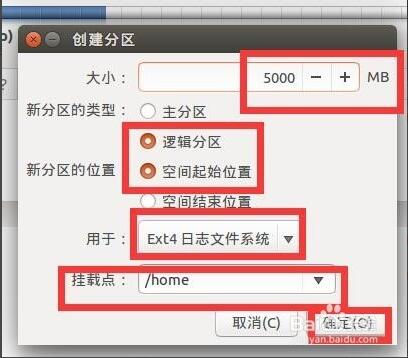

其余的空间我全部分给/usr了，空间大的话，其他的建议都给个几个GB（其他包括/var等等上main没有提及的），具体干什么用的请百度。

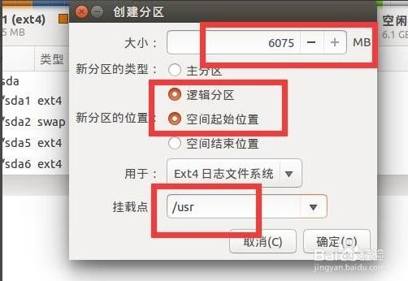

安装启动引导器的设备选择/boot对应的sda号，然后点击下面的现在安装按钮就可以了
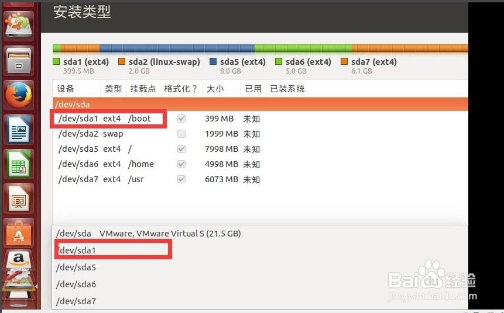
接下来，选择默认设置，一步一步继续，等待漫长的安装过程。安装完成后，拔出U盘，重启电脑，这时候直接进入原来的Windows系统说明Ubuntu系统已经安装好了，想要使用Ubuntu系统还需要添加引导，网上好多资料都推荐使用easyBCD去添加引导，感兴趣的请自行百度，本文尝试多遍均不能成功，故采用了另一种引导修复的方法吗，果然可以进入Ubuntu系统。我们选择使用一个名为boot-repair的grub修复工具。这个东西很好用的，安装也极其简单，可以说智能帮你一键修复，我也不再多夸它了，下面我们试一试就知道了： 

第一，进入terminel,先通过添加它的 PPA 版本库来安装boot-repair ，命令如下：

    1 sudo apt-get update  # 先更新版本高库，再执行下面
    2 sudo add-apt-repository ppa:yannubuntu/boot-repair  #添加源
第二，避免意外，再次更新版本库

    1 sudo apt-get update
第三，执行安装命令，安装boot-repair

    1 sudo apt-get install -y boot-repair

第四，安装完毕后就启动应用

    1 boot-repair  # 终端输入后，等几分钟 
第五，如图，选择推荐修复后，耐心等待几分钟 

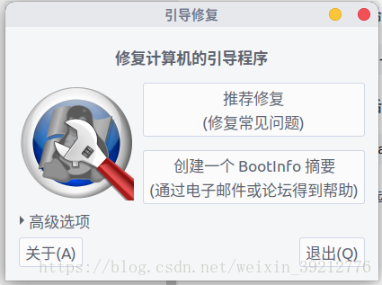

第六，待修复完毕后，直接重启

##  二、Linux下安装anaconda ##

1、首先下载anaconda3安装包，下载地址：https://www.anaconda.com/download/#linux

2、打开cmd进入安装包目录下(安装路径：默认即可，也可自定义)

3、安装anaconda

    sudo bash Anaconda3-5.0.1-Linux-x86_64.sh
(3) ubuntu18.04启动Anaconda Navigator 图形化界面，本人选择了第二种方法

方法一：

    $ source ~/anaconda3/bin/activate root
    $ anaconda-navigator

方法二：

    $ conda install -c anaconda anaconda-navigator​
    $ anaconda-navigator
原文：https://blog.csdn.net/u013372308/article/details/79235393 

# 参考引用
[如何安装win10和linux双系统](https://jingyan.baidu.com/article/4d58d5411380dd9dd5e9c07e.html)

[记录: Win10+Ubuntu18.04双系统安装](https://www.cnblogs.com/wj033/p/9420834.html)

[修复Ubuntu18.04与Windows 10双系统丢失grub引导界面](https://blog.csdn.net/weixin_39212776/article/details/81239805)